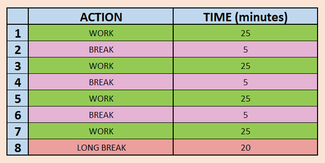
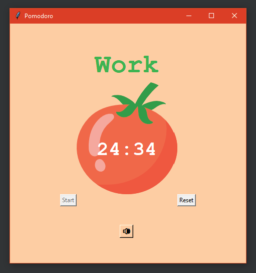

# Pomodoro

---

**Work / Break** **--->>>** Time Managing App

---
### Description
* Focus more on your work and take **regularly breaks**
* There are 8 stages see more in section 
  [Time schedule](#time-schedule)
  
* Click on **Start** button to begin the first stage
* After each action, app will
    * Go to **foreground**
    * Notify you with the 🔊**sound notification**🔊
    * Automatically start the next action
    
* You can **track number of your completed work 
  actions**
with green ticks, which are printed below the tomato

---
### Time Schedule  

---

### GUI   
   

